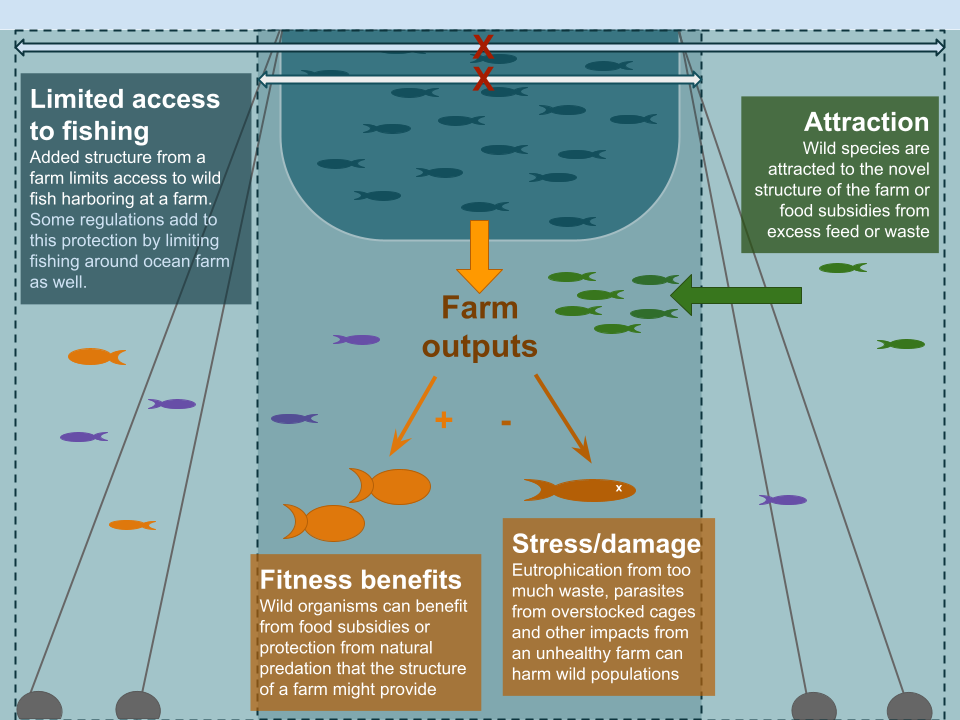

```{r warning=FALSE,message=FALSE}
knitr::opts_chunk$set(echo = TRUE,warning=FALSE,message=FALSE)

library(tidyverse)
library(spasm)
library(patchwork)
library(paletteer)
library(knitr)
library(beyonce)

```

Figures for ocean aquaculture impacts manuscript. First, one to define the model (fig 1), then represent general results and finally to give and idea of how changing key parameters like movement, attraction, farm size and impacts on the population change the results. Figure 1 will be a diagram of a farm that highlights and explains the parameters I mess with. 

## Figure 1: Farm diagram



## Figure 2: Equilibrium catches at different MPA and farm sizes

Attraction is varied and benefits from the farm are included but held constant. The committee liked the catches plot since it was most dynamic, but wanted it pulled apart to make the message that breaking the farms up into smaller spaces makes a difference, so this figure will have 2 panels, one with one large farm (A) and a second with farms broken up into smaller spaces (B). 

```{r fig.height=5}

msAttrOA<-read_csv("runs/openAccess/farmEq_msAttrOALg.csv")

msAttrOAxs<-read_csv("runs/openAccess/farmEq_msAttrOAXSm.csv") # 4 farms at 5 patches each
nullOA<-read_csv("runs/openAccess/nullOA.csv")


### Calculate biomass and catch differences 
msAttrOA2<-msAttrOA%>%
  mutate(diffBm=biomass-as.numeric(nullOA[1,"biomass"]),
         diffCtch=catch-as.numeric(nullOA[1,"catch"]))

msAttrOAxs2<-msAttrOAxs%>%
  mutate(diffBm=biomass-as.numeric(nullOA[1,"biomass"]),
         diffCtch=catch-as.numeric(nullOA[1,"catch"]))

### plot mpaSize by attraction

attrCols<-beyonce_palette(19)[c(5,2:4)]
names(attrCols)<-c("1","3","9","15")

sizeAttrCatch<-ggplot(msAttrOA2,aes(x=mpaSize,y=diffCtch,group=as.factor(attr),color=as.factor(attr)))+
  geom_hline(yintercept = 0,color="gray66")+
  geom_smooth(size=0.8,se=FALSE)+
  labs(title = "One large farm",y="Catch biomass",x="")+
  scale_y_continuous(limits = c(-1750,1000))+
  scale_x_continuous(breaks = seq(0.2,0.8,by=0.2),labels = seq(0.2,0.8,by=0.2)*100)+
  scale_color_manual(values = attrCols,name="Attraction",labels=c("None","Low","Moderate","High"))+
  theme_bw()+
    theme(axis.text=element_text(size=12),
          axis.title = element_text(size=16),
          legend.text = element_text(size=12),
        legend.title = element_text(size=16))

sizeAttrCatchS<-ggplot()+ ## replaced sm with xsm to accentuate differences (smaller farms)
  geom_hline(yintercept = 0,color="gray66")+
  geom_smooth(data=msAttrOAxs2,aes(x=mpaSize,y=diffCtch,group=as.factor(attr),color=as.factor(attr)),size=0.8,se=FALSE)+
  labs(title = "Several smaller farms",y="",x="")+
  scale_y_continuous(limits = c(-1750,1000))+
  scale_x_continuous(breaks = seq(0.2,0.8,by=0.2),labels = seq(0.2,0.8,by=0.2)*100)+
  scale_color_manual(values = attrCols,name="Attraction",labels=c("None","Low","Moderate","High"))+
  theme_bw()+
    theme(axis.text=element_text(size=12),
          axis.title = element_text(size=16),
          legend.text = element_text(size=12),
        legend.title = element_text(size=16))

## combined x-lab
x_lab <- 
  ggplot() + 
  annotate(geom = "text", x = 1, y = 1, label = "Total farm area (% of total range)", size=6) +
  theme_void()

fig1Plts<-sizeAttrCatch+sizeAttrCatchS+plot_layout(guides = "collect")+plot_annotation(tag_levels = "A", theme = theme(plot.title = element_text(size = 18)))

(fig1Plts/x_lab) + plot_layout(heights = c(1,0.05))

```

***

## Figure 3: Equilibrium biomass and catches for different movement rates

```{r}

### Farm size colors:
fsCols<-c(beyonce_palette(19)[5],beyonce_palette(22)[c(2,3,5)])
names(fsCols)<-c("20","10","5","2")

amFsOAmBen<-read_csv("runs/openAccess/farmEq_amFsBen.csv")

amFsOAmBen2<-amFsOAmBen%>%
  filter(farmSize>1)%>% ## remove smallest farms to decrease # of treatments
  mutate(diffBm=biomass-as.numeric(nullOA[1,"biomass"]),
         diffCtch=catch-as.numeric(nullOA[1,"catch"]))


amFsBenBmOAm<-ggplot(amFsOAmBen2,aes(x=adultMove,y=diffBm,group=as.factor(farmSize),color=as.factor(farmSize)))+
  geom_smooth(size=0.8,se=FALSE)+#geom_line(size=0.8)+
  scale_color_manual(values = fsCols,name="Number\nof farms",labels=20/c(2,5,10,20))+
  scale_y_continuous(limits = c(4600,25000))+
  labs(x="",y="Biomass",title = "Biomass")+
  theme_bw()+
  theme(plot.title = element_text(hjust = 0.5, size = 16),
        axis.text=element_text(size=12),
        axis.title = element_text(size=16),
        legend.text = element_text(size=12),
        legend.title = element_text(size=16))


amFsbenCtchOAm<-ggplot(amFsOAmBen2,aes(x=adultMove,y=diffCtch,group=as.factor(farmSize),color=as.factor(farmSize)))+
  geom_hline(yintercept = 0,color="gray66")+
  geom_smooth(size=0.8,se=FALSE)+
  scale_color_manual(values = fsCols,name="Number\nof farms",labels=20/c(2,5,10,20))+
  scale_y_continuous(limits = c(-400,1850))+
  labs(x="",y="Catch biomass",title = "Catch")+
  theme_bw()+
  theme(plot.title = element_text(hjust = 0.5, size = 16),
        axis.text=element_text(size=12),
        axis.title = element_text(size=16),
        legend.text = element_text(size=12),
        legend.title = element_text(size=16))


goodPlt<-amFsBenBmOAm + amFsbenCtchOAm
  # plot_annotation(title = "Adult movement by number of farms - benefits", theme = theme(plot.title = element_text(size = 18)))

```

```{r fig.height=8}

amFsOAmNeg<-read_csv("runs/openAccess/farmEq_amFsNeg.csv")

amFsOAmNeg2<-amFsOAmNeg%>%
  filter(farmSize>1)%>% ## remove smallest farms to decrease # of treatments
  mutate(diffBm=biomass-as.numeric(nullOA[1,"biomass"]),
         diffCtch=catch-as.numeric(nullOA[1,"catch"]))

amFsNegBmOAm<-ggplot(amFsOAmNeg2,aes(x=adultMove,y=diffBm,group=as.factor(farmSize),color=as.factor(farmSize)))+
  geom_smooth(size=0.8,se=FALSE)+#geom_line(size=0.8)+
  scale_color_manual(values = fsCols,name="Number\nof farms",labels=20/c(2,5,10,20))+
  scale_y_continuous(limits = c(4600,25000))+
  labs(x="",y="Biomass")+
  theme_bw()+
  theme(plot.title = element_text(hjust = 0.5),legend.position = "none",
        axis.text=element_text(size=12),
        axis.title = element_text(size=16),
        legend.text = element_text(size=12),
        legend.title = element_text(size=16))


amFsNegCtchOAm<-ggplot(amFsOAmNeg2,aes(x=adultMove,y=diffCtch,group=as.factor(farmSize),color=as.factor(farmSize)))+
  geom_hline(yintercept = 0,color="gray66")+
  geom_smooth(size=0.8,se=FALSE)+#geom_line(size=0.8)+
  scale_color_manual(values = fsCols,name="Number\nof farms",labels=20/c(2,5,10,20))+
  scale_y_continuous(limits = c(-400,1850))+
  labs(x="",y="Catch biomass")+
  theme_bw()+
  theme(plot.title = element_text(hjust = 0.5),
        axis.text=element_text(size=12),
        axis.title = element_text(size=16),
        legend.text = element_text(size=12),
        legend.title = element_text(size=16))


badPlt<-amFsNegBmOAm + amFsNegCtchOAm + plot_layout(guides = "collect")

fig2Plts<-(amFsBenBmOAm + amFsbenCtchOAm)/(amFsNegBmOAm + amFsNegCtchOAm ) +
  plot_annotation(tag_levels = 'A') + 
  plot_layout(guides="collect")

### combined x-lab
x_lab2 <- 
  ggplot() + 
  annotate(geom = "text", x = 1, y = 1, label = "Adult movement", size=6) +
  theme_void()


fig2Plts

# (fig2Plts/x_lab2) + plot_layout(heights = c(1,0.05))

```

***

## Supplemental plots

## Figure S1

Farm impacts over time for a high value open access fishery. In each plot the level of attraction is varied. Top plots represent one large farm at 20% total coverage (A, B), and the bottom plots represent the 20% farm area broken into several smaller farms (C, D). Biomass and catches are in relative to the base scenario with no farm (farm scenario/no farm scenario).

```{r}
### Color palettes

### Attraction values
attrCols<-beyonce_palette(19)[c(5,2:4)]#paletteer_d("ghibli::PonyoMedium")[c(1,3,6,4)]
names(attrCols)<-c("1","3","9","15")


### Farm size colors
fsCols<-c(beyonce_palette(19)[5],beyonce_palette(22)[c(2,3,5)])#paletteer_d("ghibli::PonyoMedium")[c(1,3,6,4)]
names(fsCols)<-c("20","10","5","2")


```


```{r}

jattDat<-read_csv("runs/openAccess/timeJattOA_perc.csv")

##### Relative plots

attLg<-jattDat%>%
  filter(farmDesign=="large",
         year<101)

diffBmOAJAtt<-ggplot(attLg[attLg$year>49,],aes(year, bmDiff*100,color=as.factor(run))) +
  geom_hline(yintercept=100,color="gray66")+
  geom_line(size=0.75)+
    # scale_y_continuous(expand=c(0,0))+
    scale_x_continuous(breaks=seq(50,100,by=10),labels=seq(0,50,by=10))+
  labs(x="Year",y="% Biomass",title="")+
  scale_color_manual(values = attrCols,name="Attraction",labels=c("0","3","9","15"))+
  theme_bw()+
  theme(axis.text = element_text(size = 10),
        axis.title = element_text(size=14))

diffCtchOAJAtt<-ggplot(attLg[attLg$year>49,],aes(year, ctchDiff*100,color=as.factor(run))) +
  geom_hline(yintercept=100,color="gray66")+  
  geom_line(size=0.75)+
    # scale_y_continuous(breaks=c(-10000,-5000,0,5000),expand=c(0,0))+
    scale_x_continuous(breaks=seq(50,100,by=10),labels=seq(0,50,by=10))+
    labs(x="year",y="% Catch",title = "")+
    scale_color_manual(values = attrCols,name="Attraction",labels=c("0","3","9","15"))+
    theme_bw()+
  theme(axis.text = element_text(size = 10),
        axis.title = element_text(size=14))

attSm<-jattDat%>%
  filter(farmDesign=="small",
         year<101)

diffBmOAJAttS<-ggplot(attSm[attSm$year>49,],aes(year, bmDiff*100,color=as.factor(run))) +
    geom_hline(yintercept=100,color="gray66")+
    geom_line(size=0.75)+
    # scale_y_continuous(expand=c(0,0))+
    scale_x_continuous(breaks=seq(50,100,by=10),labels=seq(0,50,by=10))+
    labs(x="Year",y="% Biomass",title="")+
    scale_color_manual(values = attrCols,name="Attraction",labels=c("0","3","9","15"))+
    theme_bw()+
  theme(axis.text = element_text(size = 10),
        axis.title = element_text(size=14))

diffCtchOAJAttS<-ggplot(attSm[attSm$year>49,],aes(year, ctchDiff*100,color=as.factor(run))) +
  geom_hline(yintercept=100,color="gray66")+  
  geom_line(size=0.75)+
    # scale_y_continuous(breaks=c(-10000,-5000,0,5000),expand=c(0,0))+
    scale_x_continuous(breaks=seq(50,100,by=10),labels=seq(0,50,by=10))+
  labs(x="year",y="% Catch",title = "")+
  scale_color_manual(values = attrCols,name="Attraction",labels=c("0","3","9","15"))+
  theme_bw()+
  theme(axis.text = element_text(size = 10),
        axis.title = element_text(size=14))


((diffBmOAJAtt+diffCtchOAJAtt)/(diffBmOAJAttS+diffCtchOAJAttS))+
  plot_annotation(tag_levels = "A")+
  plot_layout(guides = "collect")

```

\newpage

## Figure S2

```{r}

jattDatCE<-read_csv("runs/constantEffortMSY/timeJattCE_perc.csv")

##### Relative plots

attLgCE<-jattDatCE%>%
  filter(farmDesign=="large",
         year<101)

diffBmOAJAttCE<-ggplot(attLgCE[attLgCE$year>49,],aes(year, bmDiff*100,color=as.factor(run))) +
  geom_hline(yintercept=100,color="gray66")+
  geom_line(size=0.75)+
    # scale_y_continuous(expand=c(0,0))+
    scale_x_continuous(breaks=seq(50,100,by=10),labels=seq(0,50,by=10))+
  labs(x="Year",y="% Biomass",title="")+
  scale_color_manual(values = attrCols, name="Attraction",labels=c("None","Low","Moderate","High"))+
  theme_bw()+
  theme(axis.text = element_text(size = 10),
        axis.title = element_text(size=14))

diffCtchOAJAttCE<-ggplot(attLgCE[attLgCE$year>49,],aes(year, ctchDiff*100,color=as.factor(run))) +
  geom_hline(yintercept=100,color="gray66")+  
  geom_line(size=0.75)+
    # scale_y_continuous(breaks=c(-10000,-5000,0,5000),expand=c(0,0))+
    scale_x_continuous(breaks=seq(50,100,by=10),labels=seq(0,50,by=10))+
    labs(x="year",y="% Catch",title = "")+
    scale_color_manual(values = attrCols, name="Attraction",labels=c("None","Low","Moderate","High"))+
    theme_bw()+
  theme(axis.text = element_text(size = 10),
        axis.title = element_text(size=14))

attSmCE<-jattDatCE%>%
  filter(farmDesign=="small",
         year<101)

diffBmOAJAttSCE<-ggplot(attSmCE[attSmCE$year>49,],aes(year, bmDiff*100,color=as.factor(run))) +
    geom_hline(yintercept=100,color="gray66")+
    geom_line(size=0.75)+
    # scale_y_continuous(expand=c(0,0))+
    scale_x_continuous(breaks=seq(50,100,by=10),labels=seq(0,50,by=10))+
    labs(x="Year",y="% Biomass",title="")+
    scale_color_manual(values = attrCols, name="Attraction",labels=c("None","Low","Moderate","High"))+
    theme_bw()+
  theme(axis.text = element_text(size = 10),
        axis.title = element_text(size=14))

diffCtchOAJAttSCE<-ggplot(attSmCE[attSmCE$year>49,],aes(year, ctchDiff*100,color=as.factor(run))) +
  geom_hline(yintercept=100,color="gray66")+  
  geom_line(size=0.75)+
    # scale_y_continuous(breaks=c(-10000,-5000,0,5000),expand=c(0,0))+
    scale_x_continuous(breaks=seq(50,100,by=10),labels=seq(0,50,by=10))+
  labs(x="year",y="% Catch",title = "")+
  scale_color_manual(values = attrCols, name="Attraction",labels=c("None","Low","Moderate","High"))+
  theme_bw()+
  theme(axis.text = element_text(size = 10),
        axis.title = element_text(size=14))


((diffBmOAJAttCE+diffCtchOAJAttCE)/(diffBmOAJAttSCE+diffCtchOAJAttSCE))+
  plot_annotation(tag_levels = "A")+
  plot_layout(guides = "collect")

```

\newpage

## Figure S3

Equilibrium biomass differences given different levels of attraction to farms with farms of varying total area coverage for (A) one large contiguous farm and (B) total farm area broken up into smaller separate farms. Catch biomass difference is calculated as the difference between catch biomass with the farm scenario and a scenario with no farm.


```{r}

msAttrOA<-read_csv("runs/openAccess/farmEq_msAttrOALg.csv")
# msAttrOAs<-read_csv("runs/aqMS/farmEq_msAttrOASm.csv") # 2 farms at 10 patches each
msAttrOAxs<-read_csv("runs/openAccess/farmEq_msAttrOAXSm.csv") # 4 farms at 5 patches each
nullOA<-read_csv("runs/openAccess/nullOA.csv")
# write_csv(nullOA,"runs/aqMS/nullOA.csv")

msAttrOA2<-msAttrOA%>%
  mutate(diffBm=biomass/as.numeric(nullOA[1,"biomass"]),
         diffCtch=catch/as.numeric(nullOA[1,"catch"]))

# msAttrOAs2<-msAttrOAs%>%
#   mutate(diffBm=biomass-as.numeric(nullOA[1,"biomass"]),
#          diffCtch=catch-as.numeric(nullOA[1,"catch"]))

msAttrOAxs2<-msAttrOAxs%>%
  mutate(diffBm=biomass/as.numeric(nullOA[1,"biomass"]),
         diffCtch=catch/as.numeric(nullOA[1,"catch"]))


##### Plots
sizeAttrBm<-ggplot(msAttrOA2,aes(x=mpaSize,y=diffBm*100,group=as.factor(attr),color=as.factor(attr)))+
  geom_hline(yintercept = 100,color="gray66")+
  geom_smooth(size=0.8,se=FALSE)+
  labs(title = "One large farm",y="Total biomass",x="total farm area\n(% of total range)")+
  scale_y_continuous(limits = c(100,500))+
  scale_x_continuous(breaks = seq(0.2,0.8,by=0.2),labels = seq(0.2,0.8,by=0.2)*100)+
  scale_color_manual(values = attrCols, name="Attraction",labels=c("None","Low","Moderate","High"))+
  theme_bw()+
    theme(axis.text=element_text(size=12),
          axis.title = element_text(size=16),
          legend.text = element_text(size=12),
        legend.title = element_text(size=16),
        plot.title = element_text(size=20))

sizeAttrBmS<-ggplot()+ ## replaced sm with xsm to excentuate differences (smaller farms)
  geom_hline(yintercept = 100,color="gray66")+
  geom_smooth(data=msAttrOAxs2,aes(x=mpaSize,y=diffBm*100,group=as.factor(attr),color=as.factor(attr)),size=0.8,se=FALSE)+
  labs(title = "Several smaller farms",y="",x="total farm area\n(% of total range)")+
  scale_y_continuous(limits = c(100,500))+
  scale_x_continuous(breaks = seq(0.2,0.8,by=0.2),labels = seq(0.2,0.8,by=0.2)*100)+
  scale_color_manual(values = attrCols, name="Attraction",labels=c("None","Low","Moderate","High"))+
  theme_bw()+
    theme(axis.text=element_text(size=12),
          axis.title = element_text(size=16),
          legend.text = element_text(size=12),
        legend.title = element_text(size=16),
        plot.title = element_text(size=20))

```

```{r fig.height=5}

msAttrCE<-read_csv("runs/constantEffortMSY/farmEq_msAttCE.csv")
# msAttrOAs<-read_csv("runs/aqMS/farmEq_msAttrOASm.csv") # 2 farms at 10 patches each
msAttrCExs<-read_csv("runs/constantEffortMSY/farmEq_msAttCEsm.csv") # 4 farms at 5 patches each

nullCE<-read_csv("runs/constantEffortMSY/mpaCEruns.csv")%>%
  filter(run=="NoMPA",
         year==max(year))

# nullCE<-read_csv("runs/aqMS/nullCE.csv")

msAttrCE2<-msAttrCE%>%
  mutate(diffBm=biomass/as.numeric(nullCE[1,"biomass"]),
         diffCtch=catch/as.numeric(nullCE[1,"catch"]))

msAttrCExs2<-msAttrCExs%>%
  mutate(diffBm=biomass/as.numeric(nullCE[1,"biomass"]),
         diffCtch=catch/as.numeric(nullCE[1,"catch"]))

### plot mpaSize by attraction

sizeAttrBmCE<-ggplot(msAttrCE2,aes(x=mpaSize,y=diffBm*100,group=as.factor(attr),color=as.factor(attr)))+
  geom_hline(yintercept = 100,color="gray66")+
  geom_smooth(size=0.8,se=FALSE)+
  #geom_point()+
  labs(title = "One large farm",y="Biomass (% relative to no farm)",x="")+
  scale_y_continuous(limits = c(100,150))+
  scale_x_continuous(breaks = seq(0.2,0.8,by=0.2),labels = seq(0.2,0.8,by=0.2)*100)+
  scale_color_manual(values = attrCols,name="Attraction",labels=c("None","Low","Moderate","High"))+
  theme_bw()+
    theme(axis.text=element_text(size=12),
          axis.title = element_text(size=16),
          legend.text = element_text(size=12),
        legend.title = element_text(size=16),
        plot.title = element_text(size=20))

sizeAttrBmSce<-ggplot()+ ## replaced sm with xsm to excentuate differences (smaller farms)
  geom_hline(yintercept = 100,color="gray66")+
  geom_smooth(data=msAttrCExs2,aes(x=mpaSize,y=diffBm*100,group=as.factor(attr),color=as.factor(attr)),size=0.8,se=FALSE)+
  labs(title = "Several smaller farms",y="",x="")+
  scale_y_continuous(limits = c(100,150))+
  scale_x_continuous(breaks = seq(0.2,0.8,by=0.2),labels = seq(0.2,0.8,by=0.2)*100)+
  scale_color_manual(values = attrCols,name="Attraction",labels=c("None","Low","Moderate","High"))+
  theme_bw()+
    theme(axis.text=element_text(size=12),
          axis.title = element_text(size=16),
          legend.text = element_text(size=12),
        legend.title = element_text(size=16),
        plot.title = element_text(size=20))

fig2quadBm<-(sizeAttrBmCE+sizeAttrBmSce)/(sizeAttrBm +sizeAttrBmS)+
  plot_layout(guides = "collect")+
  plot_annotation(tag_levels = "A")&
    theme(plot.tag = element_text(face = 'bold'))

```

\newpage

## Figure S4

Equilibrium differences in total biomass and catch biomass for different species based on adult movement for farm scenarios with very damaging effects on the wild population (damage > fishing mortality). Different farm designs are tested by farm size resulting in the indicated number of farms. 


```{r}

amFsOAnegKill<-read_csv("runs/openAccess/farmEq_amFsNegKill.csv")

amFsOAKill<-amFsOAnegKill%>%
  filter(farmSize>1)%>% 
  mutate(diffBm=biomass/as.numeric(nullOA[1,"biomass"]),
         diffCtch=catch/as.numeric(nullOA[1,"catch"]))

amFsBmKill<-ggplot(amFsOAKill,aes(x=adultMove,y=diffBm*100,group=as.factor(farmSize),color=as.factor(farmSize)))+
  geom_hline(yintercept = 100,color="gray66")+
  geom_smooth(size=0.8,se=FALSE)+
  scale_color_manual(values = fsCols,name="Number\nof farms", labels=20/c(2,5,10,20))+
  scale_y_continuous(limits = c(50,100))+
  labs(x="Adult movement",y="% Biomass")+
  theme_bw()+
  theme(plot.title = element_text(hjust = 0.5),
        axis.text = element_text(size = 12),
        axis.title = element_text(size=14))


amFsCtchKill<-ggplot(amFsOAKill,aes(x=adultMove,y=diffCtch*100,group=as.factor(farmSize),color=as.factor(farmSize)))+
 geom_hline(yintercept = 100,color="gray66")+
  geom_smooth(size=0.8,se=FALSE)+#geom_line(size=0.8)+
  scale_color_manual(values = fsCols,name="Number\nof farms", labels=20/c(2,5,10,20))+
  scale_y_continuous(limits = c(0,100))+
  labs(x="Adult movement",y="% Catch")+
  theme_bw()+
  theme(plot.title = element_text(hjust = 0.5),
        axis.text = element_text(size = 12),
        axis.title = element_text(size=14))


amFsBmKill + amFsCtchKill + 
  plot_layout(guides = "collect")+
  plot_annotation(tag_levels = "A")
```

